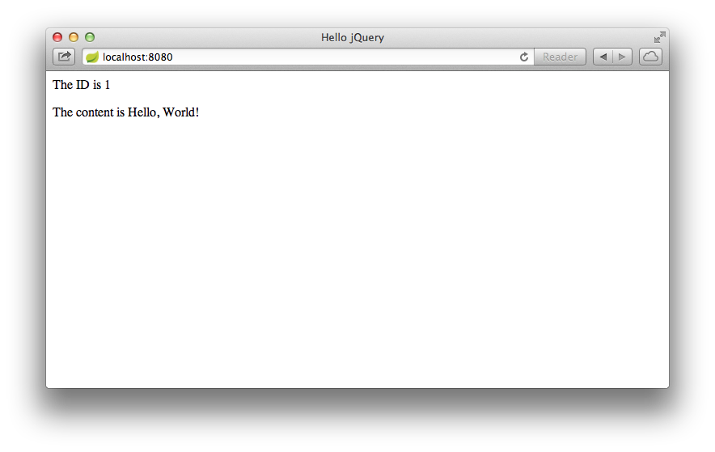

<#assign project_id="gs-consuming-rest-jquery">
<#assign spring_version="3.2.4.RELEASE">
<#assign spring_boot_version="0.5.0.M5">
This guide walks you through writing a simple jQuery client that consumes a Spring MVC-based [RESTful web service][u-rest].

What you'll build
-----------------

You'll build a jQuery client that consumes a Spring-based RESTful web service.
Specifically, the client will consume the service created in [Building a RESTful Web Servce][gs-rest-service].

The jQuery client will be accessed at:

	http://localhost:8080/

and will consume the service accepting requests at:

    http://localhost:8080/greeting

The service will respond with a [JSON][u-json] representation of a greeting:

```json
{"id":1,"content":"Hello, World!"}
```

The client will render the ID and content into the DOM.

What you'll need
----------------

 - About 15 minutes
 - <@prereq_editor_jdk_buildtools/>


## <@how_to_complete_this_guide/>


<a name="scratch"></a>
Set up the project
------------------

<@build_system_intro/>

<@create_directory_structure_hello/>


<@create_both_builds/>

<@bootstrap_starter_pom_disclaimer/>

Create the REST service
-----------------------

Now that you've set up the project and build system, you can create your web service.
Because the primary focus of this guide is to create a client to consume a REST service and not how to create the service itself, this guide will only briefly show you the components necessary to create that service.
For more details regarding the creation of the service, see [Building a RESTful Web Service][gs-rest-service]

The service will need a class to represent the resource being served.

    <@snippet path="src/main/java/hello/Greeting.java" prefix="complete"/>

It will also need a Spring MVC controller to handle requests and return the greeting resource:

    <@snippet path="src/main/java/hello/GreetingController.java" prefix="complete"/>


<a name="initial"></a>
Create a jQuery Controller
------------------------------

Now that the service classes are in place, you can create the jQuery client.
First, you'll create the jQuery controller module that will consume the REST service: 

    <@snippet path="src/main/resources/static/hello.js" prefix="complete"/>

This controller module is represented as a simple JavaScript function. It uses jQuery's `$.ajax()` method to consume the REST service at "/greeting".

If successful, it will assign the JSON received to `data`, effectively making it a `Greeting` model object.


Create the Application Page
---------------------------

Next, you'll create the HTML page that will load the client into the user's web browser:

    <@snippet path="src/main/resources/static/index.html" prefix="complete"/>

For the most part, this is a basic HTML file. But there are a few noteworthy things to draw your attention to.

First, notice that the page loads two script files. It loads the minified jQuery library (jquery.min.js) from a content delivery network (CDN) so that you don't have to download jQuery and place it in your project. It also loads the controller code (hello.js) from the application's path.

Note that the two `<p>` tags have `class` attributes with values of `greeting-id` and `greeting-content` respectively. These help jQuery to reference the HTML elements and update the text with the values from the `id` and `content` properties in the JSON received from the REST service.


Make the application executable
-------------------------------

Although it is possible to package this service as a traditional [WAR][u-war] file for deployment to an external application server, the simpler approach demonstrated below creates a standalone application. You package everything in a single, executable JAR file, driven by a good old Java `main()` method. Along the way, you use Spring's support for embedding the [Tomcat][u-tomcat] servlet container as the HTTP runtime, instead of deploying to an external instance.

### Create an Application class

    <@snippet path="src/main/java/hello/Application.java" prefix="complete"/>

The `main()` method defers to the [`SpringApplication`][] helper class, providing `Application.class` as an argument to its `run()` method. This tells Spring to read the annotation metadata from `Application` and to manage it as a component in the [Spring application context][u-application-context].

The `@ComponentScan` annotation tells Spring to search recursively through the `hello` package and its children for classes marked directly or indirectly with Spring's [`@Component`][] annotation. This directive ensures that Spring finds and registers the `GreetingController`, because it is marked with `@Controller`, which in turn is a kind of `@Component` annotation.

The [`@EnableAutoConfiguration`][] annotation switches on reasonable default behaviors based on the content of your classpath. For example, because the application depends on the embeddable version of Tomcat (tomcat-embed-core.jar), a Tomcat server is set up and configured with reasonable defaults on your behalf. And because the application also depends on Spring MVC (spring-webmvc.jar), a Spring MVC [`DispatcherServlet`][] is configured and registered for you — no `web.xml` necessary! Auto-configuration is a powerful, flexible mechanism. See the [API documentation][`@EnableAutoConfiguration`] for further details.

<@build_an_executable_jar_subhead/>

<@build_an_executable_jar_with_both/>

<@run_the_application_with_both module="service"/>

Logging output is displayed. The application should be up and running within a few seconds.


Test the client
---------------

Now that the application is running is up, visit <http://localhost:8080>, where you see:



The ID value will increment each time you refresh the page.

Summary
-------

Congratulations! You've just developed an jQuery client that consumes a Spring-based RESTful web service.

<@u_rest/>
<@u_json/>
<@u_view_templates/>
[jackson]: http://wiki.fasterxml.com/JacksonHome
<@u_war/>
<@u_tomcat/>
<@u_application_context/>
[`@Controller`]: http://docs.spring.io/spring/docs/${spring_version}/javadoc-api/org/springframework/stereotype/Controller.html
[`SpringApplication`]: http://docs.spring.io/spring-boot/docs/${spring_boot_version}/api/org/springframework/boot/SpringApplication.html
[`@EnableAutoConfiguration`]: http://docs.spring.io/spring-boot/docs/${spring_boot_version}/api/org/springframework/boot/autoconfigure/EnableAutoConfiguration.html
[`@Component`]: http://docs.spring.io/spring/docs/${spring_version}/javadoc-api/org/springframework/stereotype/Component.html
[`@ResponseBody`]: http://docs.spring.io/spring/docs/${spring_version}/javadoc-api/org/springframework/web/bind/annotation/ResponseBody.html
[`MappingJackson2HttpMessageConverter`]: http://docs.spring.io/spring/docs/${spring_version}/javadoc-api/org/springframework/http/converter/json/MappingJackson2HttpMessageConverter.html
[`DispatcherServlet`]: http://docs.spring.io/spring/docs/${spring_version}/javadoc-api/org/springframework/web/servlet/DispatcherServlet.html
[gs-rest-service]: /guides/gs-rest-service/

